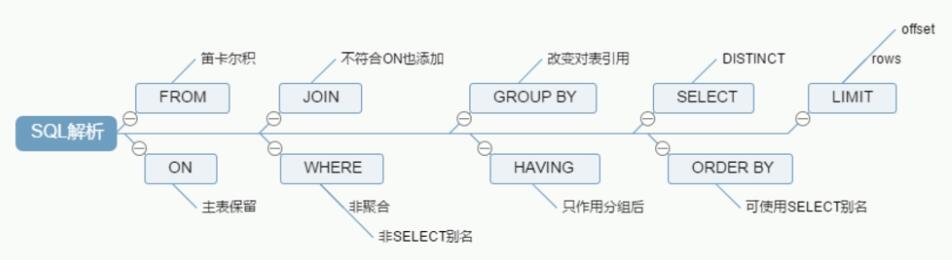
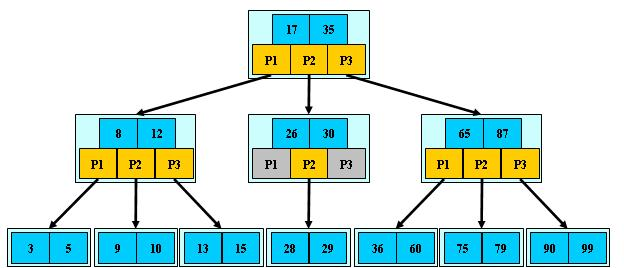
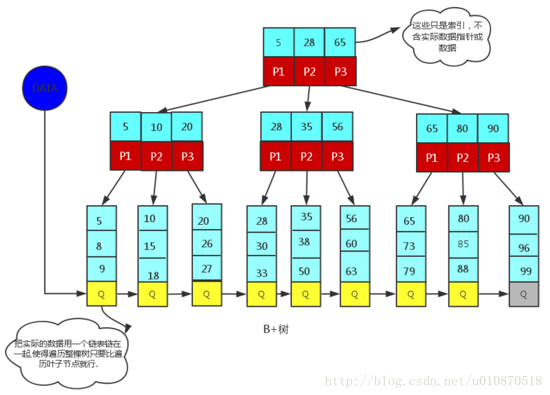

# mysql高级

### Mysql架构图

### Mysql存储引擎
- 查看存储引擎 `show engines;`
- MyISAM 和 InnoDB 对比

|对比项|MyISAM|InnoDB|
|:---|:---|:---
|**主外键**|不支持|支持
|**事务**|不支持|支持
|**行表锁**|表锁，即使操作一条记录也会锁住整个表|行锁，操作时只锁某一行，不对其他行有影响<br> **适合并发**
|**缓存**|只缓存索引，不缓存真实数据|不仅缓存真实索引还要缓存真实数据，对内存的要求较高，而且内存大小对性能有决定性影响
|**表空间**|小|大
|**关注点**|性能|事务
|**默认安装**|Y|Y

### SQL执行加载顺序
- 手写（日常写的sql顺序）
```sql
SELECT DISTINCT
    <select_list>
FROM
    <left_table> <join_type>
JOIN <right_table> ON <join_condition>
WHERE
    <where_condition>
GROUP BY
    <group by list>
HAVING
    <having_condition>
ORDER BY
    <order_by_condition>
LIMIT <limimt number>
```
- 机读 (机器读取sql顺序)
```sql
FROM <left_table>
ON <join_condition>
<join_type> JOIN <right_table>
WHERE <where_condition>
GROUP BY <group_by_list>
HAVING <having_condition>
SELECT
DISTINCT <select_list>
ORDER BY <order_by_condition>
LIMIT <limit_number>
```
- 总结

**MySql执行顺序理解**
1. 加载from子句的前两个表计算笛卡尔积，生成虚拟表vt1
2. 筛选关联表符合on表达式的数据，保留主表，生成虚拟表vt2
3. 如果使用的是外连接，执行on的时候，会将主表中不符合on条件的数据也加载进来，做为外部行
4. 如果from子句中的表数量大于2，则重复第一步到第三步，直至所有的表都加载完毕，更新vt3
5. 执行where表达式，筛选掉不符合条件的数据生成vt4
6. 执行group by子句。group by 子句执行过后，会对子句组合成唯一值并且对每个唯一值只包含一行，生成vt5,。一旦执行group by，后面的所有步骤只能得到vt5中的列（group by的子句包含的列）和聚合函数。
7. 执行聚合函数，生成vt6；
8. 执行having表达式，筛选vt6中的数据。having是唯一一个在分组后的条件筛选，生成vt7;
9. 从vt7中筛选列，生成vt8；
10. 执行distinct，对vt8去重，生成vt9。其实执行过group by后就没必要再去执行distinct，因为分组后，每组只会有一条数据，并且每条数据都不相同。
11. 对vt9进行排序，此处返回的不是一个虚拟表，而是一个游标，记录了数据的排序顺序，此处可以使用别名；
12. 执行limit语句，将结果返回给客户端

**其他**
1. on和where的区别？
    - 简单地说，当有外关联表时，on主要是针对外关联表进行筛选，主表保留，当没有关联表时，二者作用相同。
    - 例如在左外连时，首先执行on，筛选掉外连表中不符合on表达式的数据，而where的筛选是对主表的筛选。

2. 图解



### 七种Join关系
- 图示


### 索引
**索引是什么**
- 官方定义：索引（Index）是帮助 MySQL 高效获取数据的数据结构
    - 索引是数据结构
    - 详解：在数据之外，数据库系统还维护着满足特定查找算法的数据结构，这些数据结构以某种方式引用（指向）数据，这样就可以在这些数据结构上实现高级查找算法。这种数据结构就是**索引**。
- 一般来说，索引本身也很大，不可能全部存储在内存中，因此索引往往以索引文件的形式存储在磁盘上
- 平常所指的索引，如果没有特别指明，都是指 `B树(多路搜索树，不一定是二叉树)` 结构的索引。
    - 其中 聚集索引，次要索引，符合索引，前缀索引，唯一索引默认都是使用 `B+树` 索引,统称索引
    - 除了 `B+` 索引，还有哈希索引 `(hash Index)`等

**索引的优势**
- 提高数据检索的效率，降低数据库的IO成本
- 通过索引对数据进行排序，降低数据排序成本，降低了CPU的消耗

**索引的劣势**
- 实际上索引也是一张表，该表保存了主键与索引字段，并指向实体表的记录，所以索引列也是要占用空间的
- 虽然索引提高了查询速度，但是却会降低更新表的速度，如对表进行 `INSERT`,`UPDATE` 和 `DELETE`。
    - 因为更新表时，MySQL不仅要保存数据，还要保存一下索引文件每次更新添加了索引列的字段，都会调整因为更新所带来的键值变化后的索引信息
- 索引只是提高效率的一个因素，如果MySQL有大数据量的表，就需要花时间研究建立最优秀的索引，或者优化查询

**索引分类和建立索引的命令**
1. 单值索引
    - 即一个索引值包含单个列，一个表可以有多个单列索引
2. 唯一索引
    - 索引列的值必须唯一，但允许有空值
3. 复合索引
    - 即一个索引包含多个列
4. 基本语法
```text
# 创建
CREATE [UNIQUE] INDEX index_name ON table_name(columnname(length))

ALERT table_name ADD [UNIQUE] INDEX [index_name] ON (columnname(length))

# 删除
DROP INDEX [indexName] ON table_name

# 查看
SHOW INDEX FROM table_name

```
使用ALERT有四种方式来添加数据表的索引
```text
# 该语句添加一个主键，意味着索引值必须是唯一的，且不能为NULL
ALERT TABLE table_name ADD PRIMARY KEY (column_list)

# 这条语句创建索引的值必须是唯一的 （除了NULL之外，NULL可能会出现多次）
ALERT TABLE table_name ADD UNIQUE index_name (column_list)

# 添加普通索引，索引值可以出现多次
ALERT TABLE table_name ADD index_name (column_list)

# 该语句指定索引为 FULLTEXT，用于全文索引
ALERT TABLE tbl_name ADD FULLTEXT index_name (column_list)

```

**mysql索引结构**
1. B-Tree索引
    - 检索原理
    - B树和B+树的区别
2. Hash索引
3. full-text索引
4. R-Tree索引

**b树**


- 对于B树，我们首先要知道它的应用，B树大量应用在数据库和文件系统当中。
- B树是对二叉查找树的改进。它的设计思想是，将相关数据尽量集中在一起，以便一次读取多个数据，减少硬盘操作次数。
- B树为系统最优化大块数据的读和写操作。B树算法减少定位记录时所经历的中间过程，从而加快存取速度。普遍运用在数据库和文件系统。
- 假定一个节点可以容纳100个值，那么3层的B树可以容纳100万个数据，如果换成二叉查找树，则需要20层！假定操作系统一次读取一个节点，并且根节点保留在内存中，那么B树在100万个数据中查找目标值，只需要读取两次硬盘
- B 树可以看作是对2-3查找树的一种扩展，即他允许每个节点有M-1个子节点。

B树的结构要求：
1. 根节点至少有两个子节点
2. 每个节点有M-1个key，并且以升序排列
3. 位于M-1和M key的子节点的值位于M-1 和M key对应的Value之间
4. 其它节点至少有M/2个子节点
5. 所有叶子节点都在同一层

图片的理解
- 浅蓝色的是一块数据的集合
- 深蓝色的是存储的数据
- 黄色的是指针

假设要找到36，磁盘一共进行了3次I/O操作

问题：
1. B树每一个节点都存储了真实数据
    - 磁盘IO一次读出的数据量大小是固定的
    - 单个数据变大，每次读出的就少，IO次数增多（单个数据集合IO的次数也不少）
2. 为了解决这个问题，使用B+树来解决

**b+树**



- 非叶子节点不存储数据
    - 叶子节点存储数据
- 解决了 磁盘IO一次读出的数据量大小是固定的 单个数据变大 的问题
- 叶子节点的数据可以串起来，作区间查询

**什么时候应该创建索引**
1. 主键自动建立唯一索引
2. 频繁作为查询条件的字段应该创建索引
3. 查询中与其他表关联的字段，外键关系建立索引
4. 频繁更新的字段不适合创建索引，
5. where里面用不到的字段不创建索引
6. 单键/组合索引的选择 who？  （在高并发下倾向创建组合索引）
7. 查询中排序的字段，排序的字段如果通过索引将会大大提高效率
8. 查询中统计或者分组的字段

**什么时候不应该创建索引**
1. 表的记录太少
2. 经常增删改的表
    - 提高了查询表的速度，但是降低了更新表的速度，更新表的时候也要更新索引
    - Mysql不仅要保存数据也要保存索引
3. 某个列包含大量重复的内容，建立索引没有太大的实际效果

### Mysql性能分析

[**Explain**](explain.md)

### Mysql索引优化

[**单表索引优化**](索引优化_单表.md)

[**两表索引优化**](索引优化_两表.md)

[**三表索引优化**](索引优化_三表.md)

### Mysql常见的索引失效以及优化策略

[**索引失效以及优化**](索引失效以及优化.md)

[**索引面试**](索引面试.md)


### 查询截取分析
[**查询截取分析**](查询截取分析.md)

### Mysql锁
[**Mysql 锁**](mysql锁.md)

### Mysql事务的实现
[**Mysql事务的实现**](事务实现.md)


