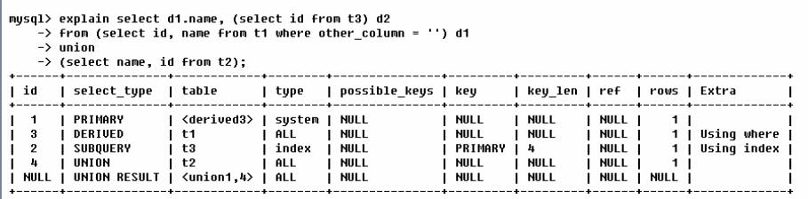

# MYSQL EXPLAIN

## Mysql性能分析

**Mysql Query Optimizer**

mysql的查询优化器

1. Mysql中有专门负责优化 SELECT 语句的优化器模块，主要功能：通过计算分析系统中收集到的统计信息，为客户端请求的Query提供它认为最优的执行计划
    - 它认为最优的数据检索方式，但不见得是 DBA 认为是最优的，这部分最消耗时间

2. 当客户端向Mysql请求一条Query,命令解析器模块完成请求分类，区别出是 SELECT 并转发给Mysql Query Optimizer,Mysql Query Optimizer首先会对整条Query进行优化，处理掉一些常量表达式的预算，直接换算成常量值。并对Query中的查询条件进行简化和转换，如去掉一些无用或显而易见的条件、结构调整等。然后分析Query中的Hint信息(如果有)，看显示Hint信息是否可以完全确定该Query的执行计划，则会读取所涉及对象的统计信息，根据Query进行写相应的计算分析，然后再得出最后的执行计划

**Mysql常见的瓶颈**

- CPU
    - CPU在饱和的时候一般发生在数据装入内存或者从磁盘上读取数据的时候
- IO
    - 磁盘I/O瓶颈发生的在装入数据远大于内存容量的时候
- 服务器硬件性能瓶颈: top free iostat 和 vmstat 来查看系统的性能状态

## Explain

**能干什么**
- 表的读取顺序
    - 从后面的学习基本可以了解成 id的大小
- 数据读取操作的操作类型
    - select_type 
- 哪些索引可以被使用
    - possible_keys
- 哪些索引被实际使用
    - key
- 表之间的引用
    - ref
- 每张表有多少被优化器查询

**执行计划包含的信息**
- id
- select_type
- table
- type
- possible_keys
- key
- key_len
- ref
- rows
- Extra

重要：

id type key ref rows Extra

## Explain id

select 查询的序列号，包含一组数字，表示查询中执行select字句或操作表的顺序

**三种情况**
1. id相同，执行顺序由上至下
2. id不同，如果是子查询，id的序号会递增，id值越大优先级越高，越先被执行
    - 谁大谁先
3. id即有相同的也有不同的
    - id如果相同，可以认为是一组，从上往下顺序执行
    - 在所有组中，id值越大，优先级越高，越先执行
    
**总结一句话**

相同顺序走，不同看谁大

derived：衍生

## Explain select_type 和 table

**select_type**

查询的类型，主要是用于区别
普通查询、联合查询、子查询等的复杂查询

- SIMPLE
    - 简单的 select 查询，查询中不包含子查询或者UNION
- PRIMARY
    - 查询中若包含任何复杂的子部分，最外层的查询则标记为 `PRIMARY`
- SUBQUERY
    - 在 select 中或者 where 中包含了子查询
- DERIVED
    - 在 From 列表中包含的子查询被标记为 DERIVED(衍生)
        - derived2 表示 衍生表的id 为 2 ，id就是上面所指的id
    - Mysql会递归执行这些子查询，把结果放在临时表里面
        - 临时表有时候会增加系统的负担，所以表的设计一定要合理一些
- UNION
    - 若第二个select 出现在 union 之后，则标记为 union
    - 若 union 包含在 from 子句 的子查询中，外层 select 将标记为 DERIVED
- UNION RESULT
    - 从 union 表获取结果的select
    
**table**

显示这一行数据是关于哪个表的

## Explain type 关键！！！

访问类型的排列

- ALL
- index
- range
- ref
- eq_ref
- const,system
- NULL

**从最好到最差依次是**

system > const > eq_ref > ref > range > index > ALL

- system
    - 表只有一行记录（等于系统表），这是const类型的特列，平时不会出现，这个也可以忽略不计
- const
    - 表示通过索引一次就找到了，const用于比较primary key和unique 索引，因为只匹配一行数据，所以很快
    - 如将主键至于 where 列表中，Mysql就能将该查询转换为一个常量
- eq_ref
    - 唯一性索引扫描，对于每个索引键，表中只有一条记录与之匹配。常见于主键或者唯一索引扫描    
- ref
    - **非唯一性索引扫描，返回匹配某个单独值的所有行**
    - 本质上也是一种索引访问，它返回所有匹配某个单独值的行，然而，它可能会找到多个符合条件的行，所以他应该属于查找和扫描的混合体
- range
    - 只检索给定范围的行，使用一个索引来选择行。 **key 列显示使用哪个索引**
    - 一般就是在你的where语句中出现了 `between`、`<` 、 `>` 、`in` 等的查询
    - 这种范围扫描比全表扫描要好，因为它只开始于索引的某一点，而结束于另一点，不用扫描全部索引
- index
    - Full index scan. index 与 ALL 的区别为 index 只遍历索引树。这通常比 ALL 快，因为索引文件通常比数据文件小
    - 也就是说：all 和 index 虽然都是读全表，但是 index 是**从索引**中读取的，而all是**从硬盘**读取的
- all
    - Full Table scan 全表扫描

一般来说 保证查询只少达到 range级别，最好能达到ref

## Explain possible_keys  key key_len

**possible_keys**

显示可能应用在这张表中的索引，一个或者多个

查询涉及到的字段上若存在索引，则该索引将被引出，**但不一定被查询实际使用**

---

**key**
- 实际使用的索引。如果为Null,则没有使用索引
- 若查询中使用了覆盖索引，则该索引仅出现在 key 列表中
    - 参考 extra 里面的 using index
---
**key_len**

表示索引中使用的字节数，可通过该列计算查询中使用的索引的长度。在不损失精确性的情况下，**长度越短越好**

key_len显示的值为索引字段的最大可能长度，**并非实际使用长度**，即key_len是根据表定义计算而得，不是通过表内检索出的

## Explain ref
显示索引的哪一列被使用了，如果可能的话，是一个常数。哪些列或者常量被用于查找索引列上的值

## Explain rows
根据表统计信息及索引选用情况，大致估算出找到所需的记录所需要读取的行数

行数越小越好

## Explain Extra
包含不适合在其它列中显示但是十分重要的信息

**包含的值 前3个很重要**
- Using filesort
    - 说明 Mysql 会对数据使用一个外部的索引排序，而不是按照表内的索引顺序进行读取
    - Mysql中无法利用索引进行的排序成为 “文件排序”
    - 最好不要产生，因为利用索引排序效率大大提高
- Using temporary
    - 使用了临时表保存中间结果，Mysql在对查询结果排序时使用临时表。常见于 order by 和分组查询 group by
    - 最好不要出现
- Using index
    - 表示相应的select 操作使用了**覆盖索引**(Covering index ),避免了访问了表的数据行，效率不错
    - 如果同时出现 Using where,表明索引被用来执行索引键值的查找
    - 如果没有出现 Using where,表明索引用来读取数据而非执行查找
    - 覆盖索引：也称之为索引覆盖
        - 理解方式一： 就是 select 的数据列从索引中就能够取得，不必读取数据行，Mysql可以利用索引返回select列表中的字段，而不必根据索引再次读取数据文件，换句话说
            - 查询列要被所建的索引覆盖
        - 理解方式二： 索引是高效找到一个行的方法，但是一般数据库也能够使用索引找到一个列的数据，因此它不必读取整个行。毕竟索引叶子节点存储了他们索引的数据；当能通过读取索引就可以得到想要的数据，那就不需要读取行了。
            - 一个索引包含了（或者覆盖了）满足查询结果的数据就叫做索引覆盖
        - 注意
            - 如果要是用索引覆盖，一定要注意select列表中只取出需要的列
            - 因为如果将所有字段一起做索引会导致索引文件过大，查询性能下降
- User where
    - 表明使用了 where 过滤
- User join buffer
    - 使用了连接缓存
- impossible where
    - where 字句的值总是false
- select table optimized away
    - 在没有 group by 子句的情况下，基于索引优化 MIN /MAX 操作或者对于 MyISAM 存储引擎优化 count(*) 操作
    - 不必等到执行阶段再进行计算，查询执行计划生成的即完成优化
- distinct
    - 优化 distinct 操作，在找到第一匹配的元组即停止找同样值的操作
    
## Explain Case

第四行（执行顺序为 1）：select_type 为 union,说明 第四个select 是 union 里的 第二个 select 最先执行 `select name,id from t2`

第二行（执行顺序为 2）: id是3，是整个查询第三个select的一部分。因查询包含在from中，所以为derived.执行 `select id name from t1 where other_column = ''`

第三行（执行顺序为 3）：select 列表中的子查询 select_type 为 subquery ，为整个查询中的第二个select.执行 `select id from t3`

第一行（执行顺序为 4）：id为1，表示是union里的第一个select,select_type列的primary表示该查询为外层查询，table 被标记为derive3,表示查询结果来自一个衍生表，其中derived3中的3代表该查询衍生自第三个select查询，即id为3的select. 执行 `select d1.name ...`

第五行（执行顺序为 5）：代表从 union的临时表中读取行的阶段，table列的 <union1,4>表示使用 id为1 和id为4的select的结果进行union操作
