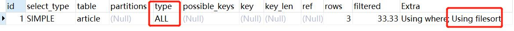
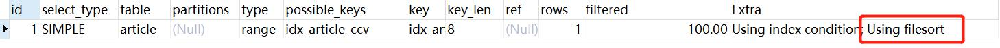
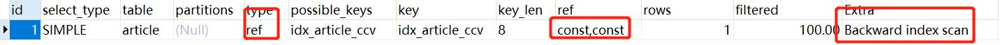
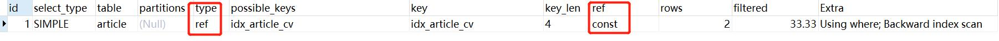

# 索引优化

## 单表索引优化
### 建表sql
```text
create table if not exists article(
    id int(10) unsigned not null primary key auto_increment,
    author_id int(10) unsigned not null,
    category_id int(10) unsigned not null,
    views int(10) unsigned not null,
    comments int(10) unsigned not null,
    title varbinary(255) not null,
    content text not null 
);

insert into article (author_id,category_id,views,comments,title,content)
values
(1,1,1,1,'1','1'),
(2,2,2,2,'2','2'),
(1,1,3,3,'3','3');

```

- 查询category_id为1，且comments 大于1的情况下，views最多的 id 和 author_id

通常会写的查询语句
```text
explain select id,author_id from article where category_id=1 and comments > 1 order by views desc limit 1;
```

问题展示：



结论：

很显然，type是ALL进行了全表扫描，Extra里面还出现了 Using filesort，也是最坏的情况。必须要优化

### 第一次优化

第一步优化：创建索引 包含3个字段 category_id , comments , views
```
create index idx_article_ccv on article(category_id,comments,views);
```

优化后的结果



还是有 Using filesort的问题

思考一下如果sql改变成下面的样子为什么呢
```
comments > 1 => commments = 1 

explain select id,author_id from article where category_id=1 and comments = 1 order by views desc limit 1;
```
explain的结果


为什么 comments > 1 => commments = 1 索引又生效了能 没有使用 Using filesort

**知识点:**这个地方就是一个**索引失效**

两次explain的结论：
- type 变成了 range 可以接受，但是 extra 里使用了 Using filesort 仍然是无法接受的
- views的索引失效了
- 按照BTree索引的工作原理
    - 网络答案：索引最左匹配原理，和索引建立的顺序有关 阅读下面的说明
    - 先排序 category_id
    - 如果遇到相同的 category_id 则再排序 comments ，如果遇到相同的 comments 则再排序 views
    - comments 在联合索引中处于 **中间位置**
    - 但是 comments > 1 是一个范围值
    - Mysql无法利用索引再对后面的 views 部分进行检索，即 range 类型查询字段后面的索引无效

### 第二次优化

**删除原来的索引，重新建立索引**
```
-- 删除原本的索引
drop index idx_article_ccv on article;
-- 创建新的索引 category_id 和 views
create index idx_article_cv on article(category_id,views);
```

explain一下
```text
explain select id,author_id from article where category_id=1 and comments > 1 order by views desc limit 1;
```


结论：

即用到了索引，也用到了索引的排序
ref下还是一个常量


