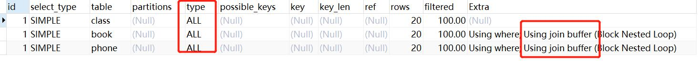
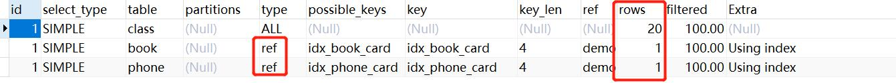

# 索引优化

## 三表索引优化

**建表的sql**
```
drop table if exists class;

create table class(
	id int(10) unsigned not null auto_increment,
	card int(10) unsigned not null,
	primary key(id)
);

drop table if exists book;

create table book(
	bookid int(10) unsigned not null auto_increment,
	card int(10) unsigned not null,
	primary key(bookid)
);

drop table if exists phone;

create table phone(
	phoneid int(10) unsigned not null auto_increment,
	card int(10) unsigned not null,
	primary key(phoneid)
);

insert into class(card) values (FLOOR(1+(RAND() * 20)));
insert into class(card) values (FLOOR(1+(RAND() * 20)));
insert into class(card) values (FLOOR(1+(RAND() * 20)));
insert into class(card) values (FLOOR(1+(RAND() * 20)));
insert into class(card) values (FLOOR(1+(RAND() * 20)));
insert into class(card) values (FLOOR(1+(RAND() * 20)));
insert into class(card) values (FLOOR(1+(RAND() * 20)));
insert into class(card) values (FLOOR(1+(RAND() * 20)));
insert into class(card) values (FLOOR(1+(RAND() * 20)));
insert into class(card) values (FLOOR(1+(RAND() * 20)));
insert into class(card) values (FLOOR(1+(RAND() * 20)));
insert into class(card) values (FLOOR(1+(RAND() * 20)));
insert into class(card) values (FLOOR(1+(RAND() * 20)));
insert into class(card) values (FLOOR(1+(RAND() * 20)));
insert into class(card) values (FLOOR(1+(RAND() * 20)));
insert into class(card) values (FLOOR(1+(RAND() * 20)));
insert into class(card) values (FLOOR(1+(RAND() * 20)));
insert into class(card) values (FLOOR(1+(RAND() * 20)));
insert into class(card) values (FLOOR(1+(RAND() * 20)));
insert into class(card) values (FLOOR(1+(RAND() * 20)));

insert into book(card) values (FLOOR(1+(RAND() * 20)));
insert into book(card) values (FLOOR(1+(RAND() * 20)));
insert into book(card) values (FLOOR(1+(RAND() * 20)));
insert into book(card) values (FLOOR(1+(RAND() * 20)));
insert into book(card) values (FLOOR(1+(RAND() * 20)));
insert into book(card) values (FLOOR(1+(RAND() * 20)));
insert into book(card) values (FLOOR(1+(RAND() * 20)));
insert into book(card) values (FLOOR(1+(RAND() * 20)));
insert into book(card) values (FLOOR(1+(RAND() * 20)));
insert into book(card) values (FLOOR(1+(RAND() * 20)));
insert into book(card) values (FLOOR(1+(RAND() * 20)));
insert into book(card) values (FLOOR(1+(RAND() * 20)));
insert into book(card) values (FLOOR(1+(RAND() * 20)));
insert into book(card) values (FLOOR(1+(RAND() * 20)));
insert into book(card) values (FLOOR(1+(RAND() * 20)));
insert into book(card) values (FLOOR(1+(RAND() * 20)));
insert into book(card) values (FLOOR(1+(RAND() * 20)));
insert into book(card) values (FLOOR(1+(RAND() * 20)));
insert into book(card) values (FLOOR(1+(RAND() * 20)));
insert into book(card) values (FLOOR(1+(RAND() * 20)));


insert into phone(card) values (FLOOR(1+(RAND() * 20)));
insert into phone(card) values (FLOOR(1+(RAND() * 20)));
insert into phone(card) values (FLOOR(1+(RAND() * 20)));
insert into phone(card) values (FLOOR(1+(RAND() * 20)));
insert into phone(card) values (FLOOR(1+(RAND() * 20)));
insert into phone(card) values (FLOOR(1+(RAND() * 20)));
insert into phone(card) values (FLOOR(1+(RAND() * 20)));
insert into phone(card) values (FLOOR(1+(RAND() * 20)));
insert into phone(card) values (FLOOR(1+(RAND() * 20)));
insert into phone(card) values (FLOOR(1+(RAND() * 20)));
insert into phone(card) values (FLOOR(1+(RAND() * 20)));
insert into phone(card) values (FLOOR(1+(RAND() * 20)));
insert into phone(card) values (FLOOR(1+(RAND() * 20)));
insert into phone(card) values (FLOOR(1+(RAND() * 20)));
insert into phone(card) values (FLOOR(1+(RAND() * 20)));
insert into phone(card) values (FLOOR(1+(RAND() * 20)));
insert into phone(card) values (FLOOR(1+(RAND() * 20)));
insert into phone(card) values (FLOOR(1+(RAND() * 20)));
insert into phone(card) values (FLOOR(1+(RAND() * 20)));
insert into phone(card) values (FLOOR(1+(RAND() * 20)));

```

**日常的sql分析**

- sql
```
explain

select * from class
left join book on class.card = book.card
left join phone on book.card = phone.card
```

- 不加索引的分析结果


- 结论
    - 所有的type都是all，代表了全表扫描，性能低
    

**在两个左连接的右表上面建立相关的索引**

```text
create index idx_book_card on book(card);

create index idx_phone_card on phone(card);
```

- explain结果


- 结论
    - 两个连接的type被优化了，直接使用索引进行查询
    - 后两行的 type 都是 ref且总rows 优化的很好
    - 因此索引设置在要经常查询的字段中

## 三表索引优化结论
- 尽可能减少 join 语句中的 NestedLoop 的循环总次数
    - 用小结果集驱动大结果集
- 保证join语句中被驱动表上的Join条件的字段已经被索引