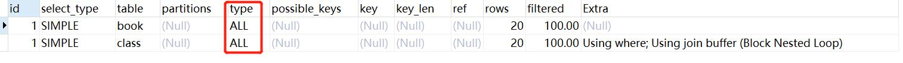
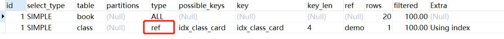
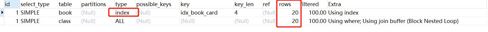
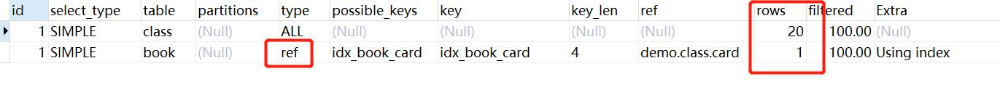

# 索引优化

## 两表索引优化
### 建表 SQL
```
drop table if exists class;
-- 分类表
create table class(
	id int(10) unsigned not null auto_increment,
	card int(10) unsigned not null,
	primary key(id)
);

drop table if exists book;

-- 书籍表
create table book(
	bookid int(10) unsigned not null auto_increment,
	card int(10) unsigned not null,
	primary key(bookid)
);

insert into class(card) values (FLOOR(1+(RAND() * 20)));
insert into class(card) values (FLOOR(1+(RAND() * 20)));
insert into class(card) values (FLOOR(1+(RAND() * 20)));
insert into class(card) values (FLOOR(1+(RAND() * 20)));
insert into class(card) values (FLOOR(1+(RAND() * 20)));
insert into class(card) values (FLOOR(1+(RAND() * 20)));
insert into class(card) values (FLOOR(1+(RAND() * 20)));
insert into class(card) values (FLOOR(1+(RAND() * 20)));
insert into class(card) values (FLOOR(1+(RAND() * 20)));
insert into class(card) values (FLOOR(1+(RAND() * 20)));
insert into class(card) values (FLOOR(1+(RAND() * 20)));
insert into class(card) values (FLOOR(1+(RAND() * 20)));
insert into class(card) values (FLOOR(1+(RAND() * 20)));
insert into class(card) values (FLOOR(1+(RAND() * 20)));
insert into class(card) values (FLOOR(1+(RAND() * 20)));
insert into class(card) values (FLOOR(1+(RAND() * 20)));
insert into class(card) values (FLOOR(1+(RAND() * 20)));
insert into class(card) values (FLOOR(1+(RAND() * 20)));
insert into class(card) values (FLOOR(1+(RAND() * 20)));
insert into class(card) values (FLOOR(1+(RAND() * 20)));


insert into book(card) values (FLOOR(1+(RAND() * 20)));
insert into book(card) values (FLOOR(1+(RAND() * 20)));
insert into book(card) values (FLOOR(1+(RAND() * 20)));
insert into book(card) values (FLOOR(1+(RAND() * 20)));
insert into book(card) values (FLOOR(1+(RAND() * 20)));
insert into book(card) values (FLOOR(1+(RAND() * 20)));
insert into book(card) values (FLOOR(1+(RAND() * 20)));
insert into book(card) values (FLOOR(1+(RAND() * 20)));
insert into book(card) values (FLOOR(1+(RAND() * 20)));
insert into book(card) values (FLOOR(1+(RAND() * 20)));
insert into book(card) values (FLOOR(1+(RAND() * 20)));
insert into book(card) values (FLOOR(1+(RAND() * 20)));
insert into book(card) values (FLOOR(1+(RAND() * 20)));
insert into book(card) values (FLOOR(1+(RAND() * 20)));
insert into book(card) values (FLOOR(1+(RAND() * 20)));
insert into book(card) values (FLOOR(1+(RAND() * 20)));
insert into book(card) values (FLOOR(1+(RAND() * 20)));
insert into book(card) values (FLOOR(1+(RAND() * 20)));
insert into book(card) values (FLOOR(1+(RAND() * 20)));
insert into book(card) values (FLOOR(1+(RAND() * 20)));

select * from class;

select * from book;

```

### 左连接分析

**分析**
```
explain select * from book left join class on book.card = class.card;
```

- 两表不加索引的结果


- 结论
    - type：ALL，会进行全表扫描，效率不高

**如果索引加在右表上**
- sql
```
create index idx_class_card on class(card);
```
- 再 explain的结果



- 结论
    - class表的type变成了 ref 效率有所提高
**如果索引加在左表上**
- sql
```
drop index idx_class_card on class;

create index idx_book_card on book(card);
```
- 再 explain的结果



- 结论
    - book表从 type:ALL 变成了 type:Index
    - 但是rows的行数还是没有变

**左连接加索引小结**
- 这是由左连接特性决定的。LEFT JOIN条件用于确定如何从右表搜索行，左边一定有
- 所以右边是左连接的关键点，一定要建立索引
- explain type角度：
    - ref的性能要大于index
    - 右表加了索引之后，还会减少rows

### 右连接分析

- 和左连接类似，是左边的表驱动右边的表，索引要加在左边的表上面

**查询sql分析**
```
explain select * from book right join class on book.card = class.card;
```
**建立索引sql**
```
create index idx_book_card on book(card);
```

**explain结果**


- 结论
    - 和左连接右表加索引是一样的
    
### 左右连接索引小结
- 左连接索引加右表
- 右连接索引加左表