# 索引失效

## 索引失效

**应该避免索引失效！！！**

## 案例分析

- sql

```
drop table if exists staff;

create table staff(
	id int primary key auto_increment,
	name varchar(25) not null default '' comment '姓名',
	age int not null default 0 comment '年龄',
	pos varchar(20) not null default '' comment '职位',
	add_time timestamp not null default CURRENT_TIMESTAMP comment '入职时间'
)charset utf8 comment '员工记录表';

insert into staff(name,age,pos,add_time) values
('z3',22,'manager',NOW()),
('July',23,'dev',NOW()),
('2000',23,'dev',NOW());

select * from staff;

alter table staff add index idx_staff_name_age_pos(name,age,pos);
```

- 分析

1. 全值匹配最好
    - ① 针对上面的表，分析下面的语句，**注意一下where后面的顺序**
    ```
    -- 索引：idx_staff_name_age_pos(name,age,pos)
   
    explain select * from staff where name='July';
    explain select * from staff where name='July' and age=23;
    explain select * from staff where name='July' and age=23 and pos='dev';
    ```
    - 结果图
    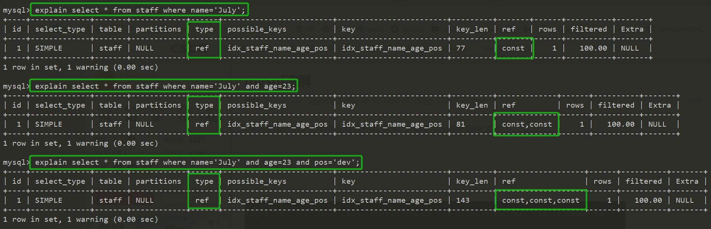
        - 分析： 索引都用上了
    - ② 如果 **不按照索引的顺序查询**，分析下面的语句
    ```
    -- 索引：idx_staff_name_age_pos(name,age,pos)
   
    explain select * from staff where age=23 and pos='dev';
    ```
    - 结果图
    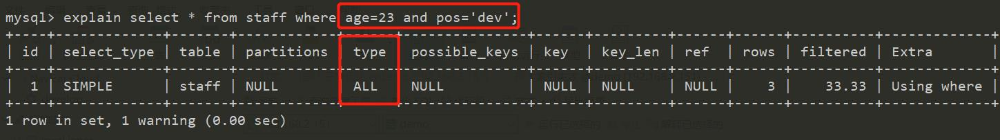
        - 建了索引但是没有用到，变成了全表扫描，索引失效了
    - 同理：分析
    ```
    explain select * from staff where age=23 and pos='dev';
    ```
   - 结果图
   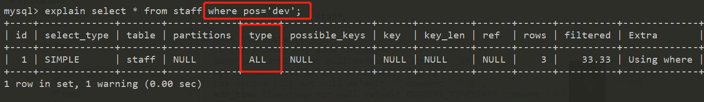

   - ③结论：最左前缀原则
2. 最佳左前缀法则
    - 如果索引使用了多列，要遵守最左前缀原则。指的是查询从索引最左的列开始并且**不跳过索引中间的列**
    - 带头大哥不能死，中间兄弟不能断
    - 案例分析
    ```
    -- 中间断了
    explain select * from staff where name='July' and pos='dev';
    ```
    - 结果图
    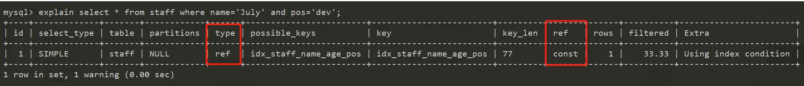
        - 虽然索引生效了
        - 但是只有一列生效：name的列，pos还是没有用到索引
            - 因为 跳过了索引中间的列
    
3. 不在索引列上作任何操作（计算、函数、（自动or手动）类型转换），会导致索引失效转而全表扫描
    - 分析以下的sql
    ```
    explain select * from staff where left(name,4) = 'July'
    ```
    - 结果图
    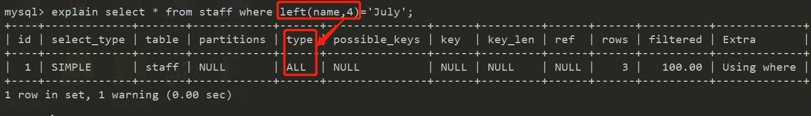
        - 索引字段上面加了函数，导致**索引失效**，造成了全表扫描
4. 存储引擎不能使用索引中范围条件右边的列
    - 分析下面的sql
    ```
    -- 还是之前的索引，但是第二个索引查找的值变成了一个范围
    explain select * from staff where name='July' and age>23 and pos='dev';
    ```
    - 结果图
    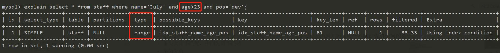
        - 索引只用到了 name 和 age
        - name 索引用来定位 age 索引用来范围查找
        - pos的索引失效了
        - 索引不完全使用了
    - mysql的复合索引的在范围条件后面的索引失效
    
5. 尽量使用覆盖索引（只访问索引的查询（索引列和查询列一直）），减少 `select *`
    - 按需取数据，尽量和索引重合
    - 对比一下两个 explain
    ```
    explain select * from staff where name='July' and age=23 and pos='dev';
    explain select name,age,pos from staff where name='July' and age=23 and pos='dev';
    ```
    - 结果图
    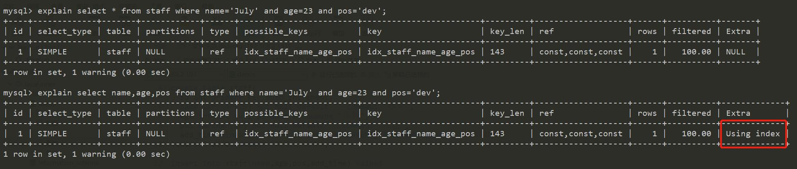
        - Extra多出使用索引查询
    - 再分析一下下面的sql
    ```text
    explain select name,age,pos from staff where name='July' and age>23 and pos='dev';
    ```
    - 结果图
    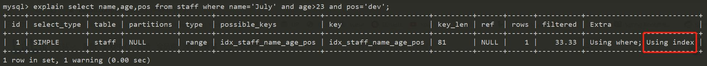
        - 这个sql想当与直接在索引上取数据，所以没有之前出现的type:range
        - 出现 `Using index` 代表性能非常好，直接在索引上查找
    - 同理接着分析下面两个sql:
    ```
    explain select name,age,pos from staff where name='July' and age=23;
    -- 索引的字段覆盖了查询的字段
    explain select name from staff where name='July' and age=23;
    explain select age from staff where name='July' and age=23;
    ```
    - 结果图
    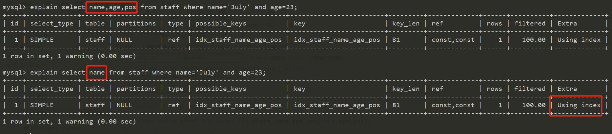
        - 这些结果都会使得查询直接在索引上进行，效率非常高
    
6. mysql 在使用不等于（`!=`或者`<>`）的时候无法使用索引会导致全表扫描
    - 分析一下下面的sql
    ```
    explain select * from staff where name='July';
    -- 对比项
    explain select * from staff where name!='July';
    explain select * from staff where name<>'July';
    ```
    - 结果图对比
    - `Mysql8` 的结果图
    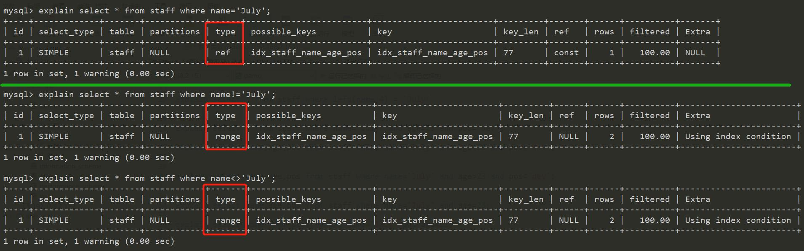
        - Mysql8 好像对这里进行了优化，不会导致索引失效了
        - Mysql5 会导致索引失效
    - `Mysql5.7` 的结果图
    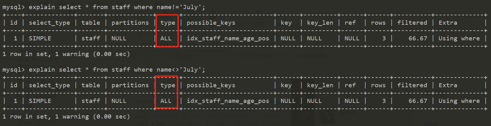
        - 发现明显是全表扫描，性能下降了很多
7. is null,is not null 也无法使用索引
    - 分析下面的sql
    ```
    -- 对比项
    explain select * from staff where name is null;
    explain select * from staff where name is not null;
    ```
   - 结果图
    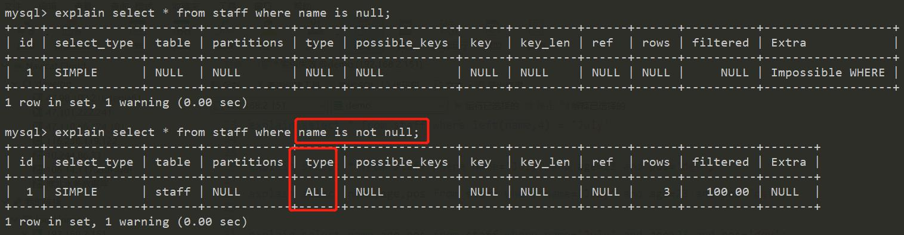
        - 通过示例表示 使用 `is not null` 的时候索引失效了
        - 这个例子里面 `is null` 显示 `Extra:Impssoble WHERE` 源于建表语句 `NOT NULL`
8. `like` 以通配符开头（`%abc...`） 会使mysql索引失效会导致全表扫描操作
    - 分析下面的sql
    ```
    explain select * from staff where name like '%July%';
    explain select name from staff where name like '%July%';
    ```
    - 结果图
    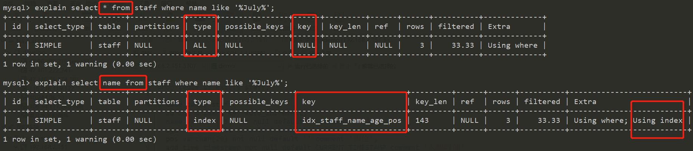
        - `like` 子句以通配符`%`开头，会导致索引失效  
        - 但是为什么 `select name` 索引没有失效
            - 猜测是因为索引覆盖的原因
    - 再分析下下面的sql，**通配符放在后面**
    ```
    explain select * from staff where name like 'July%';
    ```
    - 结果图
    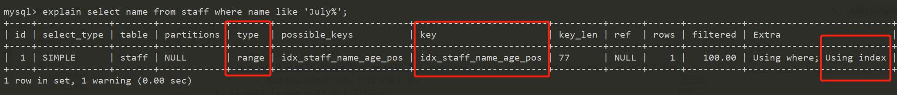
        - 这时候还是使用了索引效率提高
    - 总结
        - `like 的 通配符最好在右边`
        - `like` 解决的最好办法是使用 `覆盖索引（索引覆盖）` 来解决
        
9. 字符串不加单引号索引失效
    - 分析下以下的sql
    ```
    explain select * from staff where name=2000;
    ```
    - 结果图
    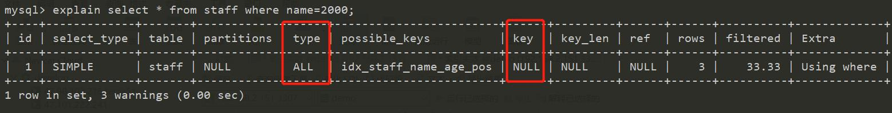
        - name 字段是 `varchar` 类型，存在一行数据 `name = '200'`
        - 但是查询的时候 字符串没有加 `'` 导致了索引失效
            - 内在原因是因为mysql底层实现了一次类型转换
                - 整型到字符类型的转换
            - 回归第3点，不要再索引列上作任何操作，底层做了操作，所以不满足
        - 最终导致全表扫描，性能下降
10. 少用 or ，用它来连接时会导致索引失效（mysql8 里面可能不会出现）
    - 分析一下下面的sql
    ```
    explain select * from staff where name='July' or name='z3';
    ```
    - 结果图
        - Mysql5.7 索引失效了
        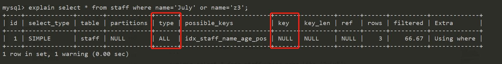
        - Mysql8 索引没有失效，系统更新的底层优化
        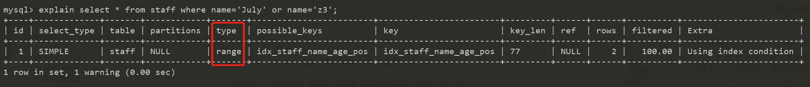
      
    

**小总结**
- 假设 index(a,b,c)

- 总结

|where 语句|索引是否被使用
|:---|:---
|`where a=3`|Yes. 使用到了`a`
|`where a=3 and b=5`|Yes. 使用到了`a`,`b`
|`where a=3 and b=5 and c=4`|Yes. 使用到了`a`,`b`,`c`
|`where a=3 或者 where b=3 and c=4 或者 where c=4`|No.
|`where a=3 and c=5`|使用到了 `a`，但是没有使用 `c`,因为`b`在中间断了
|`where a=3 and b>4 and c=5`|使用到了`a`和`b`，因为`c`在范围之后，所有没有用到索引
|`where a=3 and b like 'kk%' and c=4`|`a`能用索引，`b`能用索引；`c`不能用索引，因为`b`是一个范围

