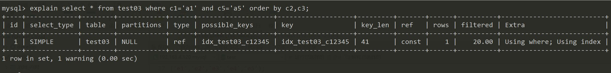

### 建表语句
```
create table test03(
    id int primary key not null auto_increment,
    c1 char(10),
    c2 char(10),
    c3 char(10),
    c4 char(10),
    c5 char(10)
);

insert into test03 
(c1,c2,c3,c4,c5)
values 
('a1','a2','a3','a4','a5'),
('b1','b2','b3','b4','b5'),
('c1','c2','c3','c4','c5'),
('d1','d2','d3','d4','d5'),
('e1','e2','e3','e4','e5');

select * from test03;
```

- 创建索引
```
create index idx_test03_c12345 on test03(c1,c2,c3,c4,c5);

show index from test03;
```

### 根据以下情况分析索引的使用情况

1. 全值匹配
    - 分析下面的sql
    ```
    explain select * from test03 where c1='a1';
    explain select * from test03 where c1='a1' and c2='a2';
    explain select * from test03 where c1='a1' and c2='a2' and c3='a3';
    explain select * from test03 where c1='a1' and c2='a2' and c3='a3' and c4='a4';
    ```
    - 基本都是全值匹配，性能高
    - 结果图
    

2. 交换`c3`和`c4`的位置
    - 分析下面的sql
    ```
    explain select * from test03 where c1='a1' and c2='a2' and c3='a3' and 'c4'='a4';
    ```
    - 结果图
    
    - 为什么交换了顺序也用到了索引
        - 因为mysql的执行器对我们书写的mysql语句进行了优化
        - 所以下面的sql的解释结果也会是一样的
        ```
        explain select * from test03 where c4='a4' and c3='a3' and c2='a2' and 'c1'='a1';
        ```
        - 最好是按照索引的顺序写，避免mysql解释语句的时候还要去优化一下

3. `c3`添加范围
    - 分析下面的sql
    ```
    explain select * from test03 where c1='a1' and c2='a2' and c3>'a3' and c4='a4';
    ```
    - 结果图
    
    - 用了几个索引
        - **范围之后全失效**，所以 `c4` 的索引没有用上
        - 用到了c3上面索引的排序，后面的就没有用到了
4. 再思考下下面的索引的使用情况
    - 分析下面的sql
    ```
    explain select * from test03 where c1='a1' and c2='a2' and c4>'a4' and c3='a3';
    ```
    - 使用了多少个索引
        - 4 个
        - 因为mysql的执行器会作出一次优化
5. `order` 的情况
    - 分析下面的sql
    ```
    explain select * from test03 where c1='a1' and c2='a2' and c4>'a4' and c3='a3';
    ```
    - 结果图
    
    - 分析
        - `ref` 级别效率还可以
        - 索引的两大功能
            - **查找**
            - **排序**
        - `c3`的作用在于排序而不是查找
6. 对比两个order的情况
    - 分析一下两种sql
    ```
    explain select * from test03 where c1='a1' and c2='a2' order by c3;
    -- 出现了 filesort 
    explain select * from test03 where c1='a1' and c2='a2' order by c4;
    ```
    - 结果图
    
    - 分析
        - 都用到了索引
        - 但是在第二种排序的时候用到了 `filesort` 是一种性能很低的情况
            - 因为多值索引在使用的时候中间的值不能断
            - `filesort` 就是内部产生的排序，没有用到索引的排序，导致了性能的下降

7. 分析 order两个 的情况
    - 分析下面的sql
    ```
    explain select * from test03 where c1='a1' and c5='a5' order by c2,c3;
    ```
    - 结果图
    
    - 分析
        - 也用到了部分的索引
        - 只用c1一个字段索引，但是c2,c3用于排序，无 filesort

8. 和上面对比一下    
    - 分析下面的sql
    ```
    --  c2,c3 ---> c3,c2
    explain select * from test03 where c1='a1' and c5='a5' order by c3,c2;
    ```
    - 结果图
    
    - 分析
        - 出现了filesort
        - 因为我们建立索引的顺序是 1,2,3,4 但是实际使用的顺序却变成了1,3,2... 所以索引的排序失效了

9. 再和上面的sql对比一下
    - 分析下面的sql
    ```
    --  c1='a1' and c5='a5' ---> c1='a1' and c2='a2'
    explain select * from test03 where c1='a1' and c2='a2' order by c2,c3;
    ```
    - 结果图
    
    - 分析
        - 不会出现什么问题，索引基本都用上了

10. 再和上面的sql对比一下
    - 分析下面的sql
    ```
    --  c1='a1' and c5='a5' ---> c1='a1' and c2='a2'
    explain select * from test03 where c1='a1' and c2='a2' and c5='a5' order by c2,c3;
    ```
11. 排序字段变成了常量了 filesort 消失
    - 分析下面的sql
    ```
    --  c1='a1' and c5='a5' ---> c1='a1' and c2='a2'
    explain select * from test03 where c1='a1' and c2='a2' and c5='a5' order by c2,c3;
    ```
    - 结果图
    
    - 分析
        - 正是因为 c2 在查询的时候是一个常量，所以c3在排序的时候不受c2的影响
        - 所以没有出现 filesort 
        - 可以理解成 c2 对排序影响不大
12. 分析 `group by`
    - 分析下面两种情况
    ```
    explain select * from test03 where c1='c1' and c4='c4' group by c2,c3;
    -- 用到了临时表 效率十分低下
    explain select * from test03 where c1='c1' and c4='c4' group by c3,c2;
    ```
    - 分析
        - `group by` 表面上叫做分组
        - 但是 **分组之前必先排序**
        - 定值、范围还是排序，一般order by是给个范围
        - group by 基本上都需要进行排序，会有临时表产生
### 小结 一般性建议
1. 对于单值所以，尽量选择当前query过滤性更好的索引
2. 在选择组合索引的时候，当前query中过滤性最好的字段在索引字段顺序中，位置越靠前（越靠左）越好
3. 在选择组合索引的时候，尽量选择可以能够包含当前query中的where字句中更多字段的索引
4. 尽可能通过分析统计信息和调整query的写法来达到选择适合索引的目的
